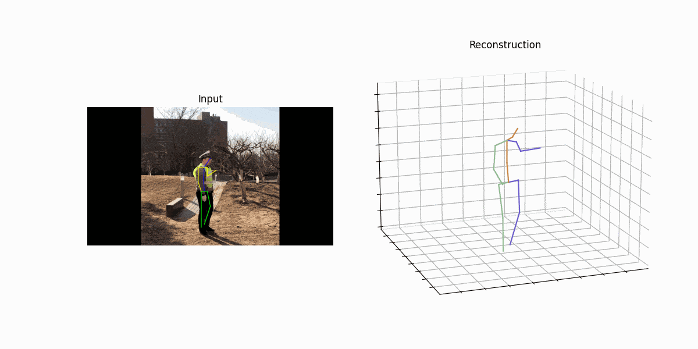

# 2D to 3D PoseEstimation
Replace the 2D PoseEstimation model with a more sophisticated model.
- Add processor_img_2d_open.py to convert input to 2D joints using the better OpenPose model
- Linearly interpolate 2d keypoints in OpenPose joints
- Convert interpolated 2D joints (18joints) to h3.6m 2D joints (17joints)
- Plot h3.6m 2d skeleton in every frame of input video
- Define classification algorithm to classify output

### Results
#### Turn Right Gesture

#### Stop Gesture

#### Turn Left Gesture


### Requirements 
```
pip install opencv-python matplotlib
```

### Requirements
**Huawei Atlas 200DK board**

Image to 2D Keypoints Model
Download [OpenPose_model](https://www.notion.so/OpenPose-Model-Script-for-Inference-947bcb0227614dbd9578d7442c69144b#0b5b1688e4044ee9bb7297c19c3e8340) and place it under model/ directory

2D to 3D Lifting Model (VideoPose3D)
``` 
# See Release
wget -nc --no-check-certificate https://github.com/Ascend-Huawei/3DPoseEstimation/releases/download/v0/video_pose_3d.om -O model/video_pose_3d.om
```

### Quick Run
```
cd 3DPoseEstimation/
python run.py     --model2D ./model/OpenPose_for_TensorFlow_BatchSize_1.om     --model3D ./model/video_pose_3d.om     --input ./data/{VIDEONAME}.mp4     --output_dir='./outputs'
```

#### Acknowledgments
Current Repository is built on top of [Huawei3D](https://github.com/Ascend-Huawei/3DPoseEstimation) and [VideoPose3D](https://github.com/facebookresearch/VideoPose3D)