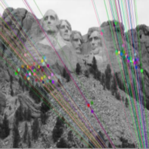
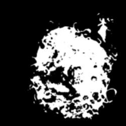
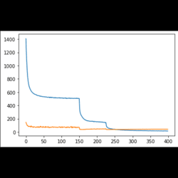
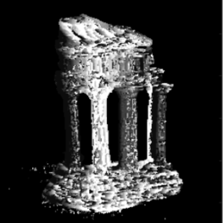

# Cool-Small-Vision-Graphics-Projects
A collection of vision,graphics projects, they are all kinds of assignments and projects in my master's for learning purposes.
|  1. Active Contours  |  2. 8Point+RANSAC|
:------------------------------:|:-------------------------:
  |  
| 3. Pose Estimation |  4. U-net|
  |  
| 5. DenseNet        |  6. PointNet |
  |  
| 7. A Small AR APP     |  8. Non DL 3D Reconstruction  |
  |  
| 9. Coons Patch     |  8. VRGame |
  |  
