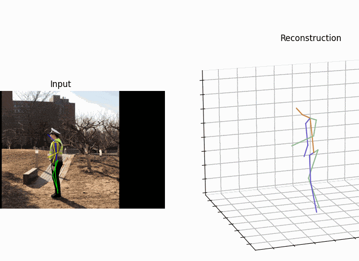

# Cool-small-Computer-Vision-Projects
A collection of small computer vision projects, they are all kinds of assignments and projects in my master for learning purposes.

| Active Contours               |  8Point+RANSAC |
:------------------------------:|:-------------------------:
 |  
| Pose-Estimation |  U-net|
  |  
| A-Small-AR-APP        |  Traditional-3D-reconstruction |
  |  
| U-Net       |  Pose-Estimation |
  |  
| Coons Patch     |  VRGame |
  |  
